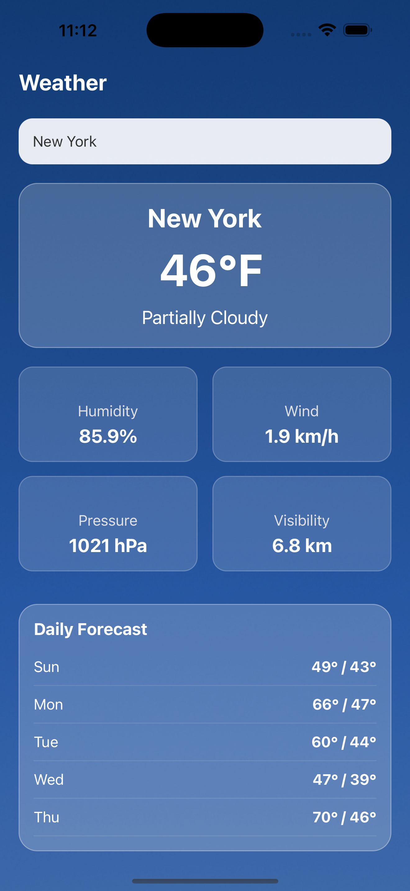

# Weather App - Expo React Native



A beautiful weather application built with React Native Expo that shows current weather conditions and forecasts for any city worldwide.

## Features

- 🌦️ Current weather conditions with temperature, humidity, wind speed, pressure, and visibility
- 📅 5-day weather forecast
- 🌙 Dark/Light mode support
- 🔄 Offline support with cached data
- 🔍 City search functionality
- 📱 Responsive design for all mobile devices

## Prerequisites

Before you begin, ensure you have the following installed:

- Node.js (v16 or newer)
- npm or yarn
- Expo CLI (`npm install -g expo-cli`)
- Expo Go app on your iOS/Android device (or use an emulator)

## Installation

1. **Clone the repository**

```bash
git clone https://github.com/yourusername/weather-app.git
cd weather-app
```

2. **Install dependencies**

```bash
npm install
# or
yarn install
```

3. **Set up environment variables**

Create a `.env` file in the root directory:

```env
WEATHER_API_KEY=your_visualcrossing_api_key
```

*Note: Get your free API key from [VisualCrossing Weather API](https://www.visualcrossing.com/weather-api)*

## Running the App

### Development Mode

1. **Start the development server**

```bash
expo start
# or
npm start
# or
yarn start
```

2. **Run on your device**

- **Option 1**: Scan the QR code with the Expo Go app (iOS/Android)
- **Option 2**: Press `i` for iOS simulator or `a` for Android emulator

### Production Build

To create a production build:

```bash
expo build:android
# or
expo build:ios
```

## Project Structure

```
weather-app/
├── assets/               # App assets (icons, images)
├── src/
│   ├── api/              # API services
│   ├── components/       # Reusable components
│   ├── context/          # Context providers
│   ├── hooks/            # Custom hooks
│   ├── navigation/       # Navigation setup
│   ├── screens/          # App screens
│   ├── types/            # TypeScript types
│   └── utils/            # Utility functions
├── App.tsx               # Main app component
├── app.config.js         # Expo configuration
└── package.json          # Project dependencies
```

## Configuration

### API Setup

The app uses the VisualCrossing Weather API. To set up:

1. Get your API key from [VisualCrossing](https://www.visualcrossing.com/weather-api)
2. Add it to your `.env` file:

```env
WEATHER_API_KEY=your_api_key_here
```

### Theme Configuration

The app supports light/dark mode. To customize the themes:

1. Edit `src/context/ThemeContext.tsx`
2. Modify the light and dark theme objects

## Troubleshooting

### Common Issues

1. **API Key Not Working**
   - Ensure the key is correctly set in `.env`
   - Verify the key is active on VisualCrossing

2. **App Not Loading**
   - Try clearing the cache: `expo start -c`
   - Restart the development server

3. **Storage Errors**
   - On iOS Simulator, sometimes restarting the simulator helps
   - Consider using SecureStore as shown in the solutions above

### Debugging

- Enable React Native Debugger: `expo start --dev-client`
- View logs: `expo logs`

## Dependencies

Main dependencies include:
- React Native
- Expo
- TypeScript
- React Navigation
- AsyncStorage
- Expo SecureStore
- React Native Vector Icons

## License

This project is licensed under the MIT License - see the [LICENSE](LICENSE) file for details.

## Contributing

Contributions are welcome! Please follow these steps:

1. Fork the repository
2. Create your feature branch (`git checkout -b feature/AmazingFeature`)
3. Commit your changes (`git commit -m 'Add some AmazingFeature'`)
4. Push to the branch (`git push origin feature/AmazingFeature`)
5. Open a Pull Request

## Support

For support, please open an issue on GitHub or contact the maintainer.

---

Enjoy the weather! ☀️🌧️❄️